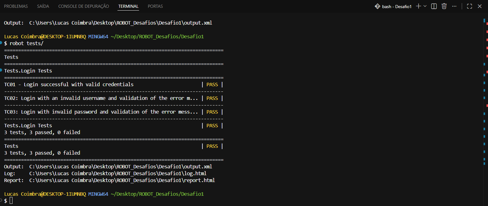
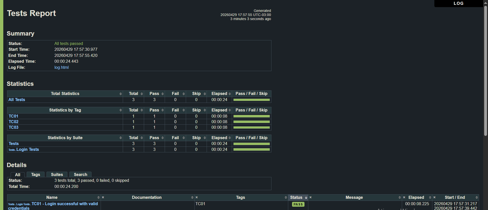

# Robot Framework - Login Tests

Automated login tests using Robot Framework and Selenium

## 📌 Descrição

Automação de testes de login utilizando Robot Framework + Selenium.
Os testes foram realizados utilizando o seguinte site:
https://practicetestautomation.com/practice-test-login/

## 🧪 Cenários cobertos

- Login com credenciais válidas
- Login com usuário inválido
- Login com senha inválida

## 🛠️ Tecnologias

- Robot Framework
- SeleniumLibrary
- Python

## ▶️ Como executar

1. Instalar dependências:

```bash
pip install robotframework
pip install robotframework-seleniumlibrary
```

2. Como executar os testes:

   Com o Terminal Aberto:

   Ex: robot tests/

   Com filtro:

   robot -d Results -i TC03 ./tests/login_tests.robot

   -d: Faz com que os arquivos de relatorio sejam gerados automaticamente em uma pasta, no caso do exemplo, Results.

   -i: Faz com que apenas os cenários de testes com essa tag rodem, isso evita ter que rodar todos de uma vez sem necessidade, no caso do exemplo, é a Tag TC03.

## 📊 Relatório

Após a execução, os relatórios são gerados automaticamente:

- log.html
- report.html

## 📸 Evidências

### Execução dos testes



### Relatório


